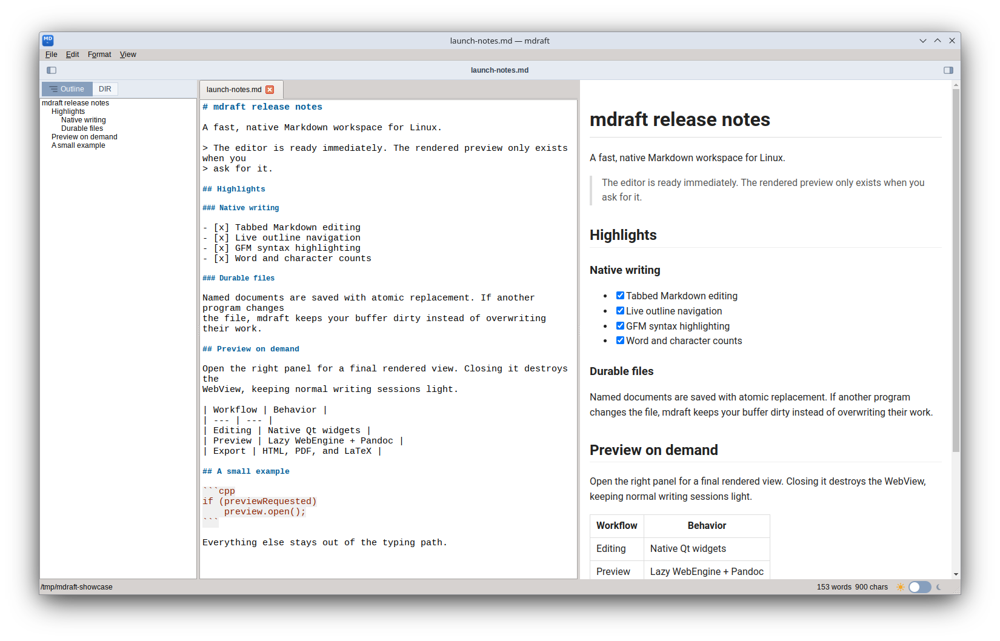
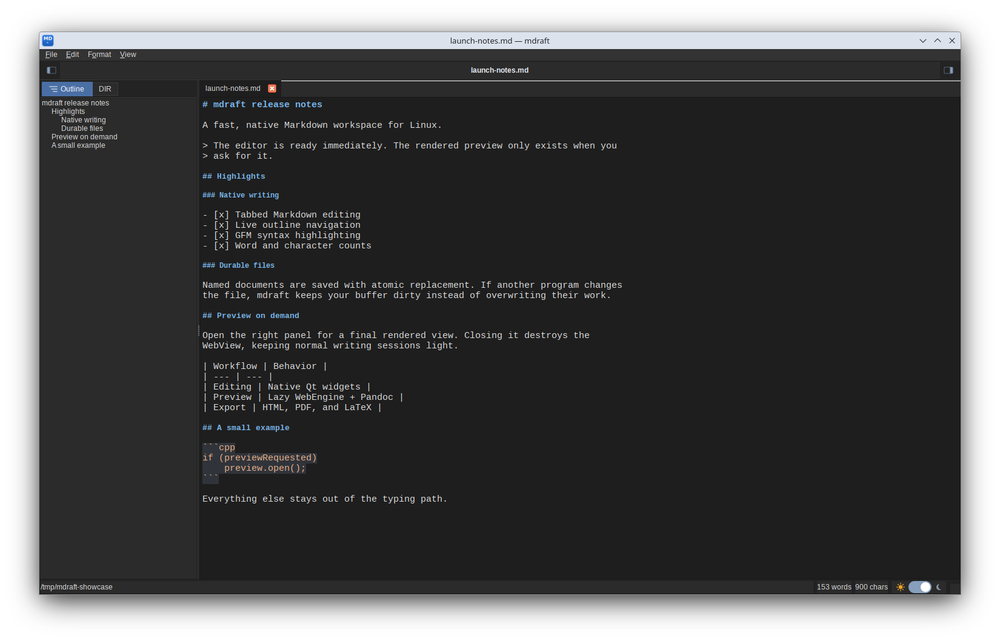

# mdraft

**Fast, native Markdown editor for Linux with on-demand preview, outline
navigation, atomic autosave, and Pandoc export.**

mdraft is a Linux-first C++/Qt editor for people who want a responsive writing
surface without paying the startup cost of a browser engine. Editing is
available immediately; the rendered preview is created only when opened and is
destroyed when closed.



## Highlights

- **Native, tabbed editor** with GFM-aware syntax highlighting, live word and
  character counts, formatting actions, and font controls.
- **Outline and directory navigation** in a native left panel. Jump between
  headings or open sibling `.md` and `.markdown` files without leaving the
  editor.
- **Preview on demand.** `QWebEngineView` does not exist at startup or while
  the preview is closed. Opening it renders the current buffer through Pandoc.
- **Defensive preview.** JavaScript is disabled and remote subresources are
  blocked, so raw HTML in a document cannot phone home when previewed.
- **Durable autosave.** Named documents are replaced atomically, external
  changes are detected, and failed writes keep the tab dirty instead of
  silently discarding work.
- **Asynchronous export** of the current buffer to standalone HTML, PDF, or
  LaTeX. Conversion never blocks the editor UI.
- **Light and dark themes** with persisted window and theme settings.

## Focused editing

The native outline stays useful while the WebEngine preview is completely
absent.



## Requirements

Build requirements:

- Linux desktop
- CMake 3.16 or newer
- C++17 compiler
- Qt 6 Widgets, Gui, and Core
- Qt 6 WebEngineWidgets for rendered preview support (optional)

Runtime tools are discovered only when the related action is used:

- [Pandoc](https://pandoc.org/) for preview and HTML/LaTeX/PDF export
- `pdflatex` from a TeX distribution for PDF export only

Missing optional tools never delay application startup.

## Build

```sh
cmake -S . -B build -DCMAKE_BUILD_TYPE=Release
cmake --build build --parallel
./build/mdraft
```

To build without rendered preview support:

```sh
cmake -S . -B build -DMDRAFT_ENABLE_WEBENGINE=OFF
cmake --build build --parallel
```

## Install

After building, install for the current user without root access:

```sh
packaging/install-user.sh build
```

This installs the binary, application icon, and desktop entry under
`~/.local`. mdraft then appears in application launchers and Markdown file
"Open with" menus.

## Usage

```sh
mdraft [files...]
mdraft --file <path>
```

Multiple files open as tabs.

| Action | Shortcut |
| --- | --- |
| New document | `Ctrl+N` |
| Open | `Ctrl+O` |
| Save | `Ctrl+S` |
| Toggle outline/DIR panel | `Ctrl+1` |
| Toggle rendered preview | `Ctrl+3` |
| Toggle light/dark mode | `Ctrl+D` |
| Bold / italic | `Ctrl+B` / `Ctrl+I` |
| Increase / decrease editor font | `Ctrl++` / `Ctrl+-` |

## Tests

```sh
cmake -S . -B build -DBUILD_TESTING=ON
cmake --build build --parallel
ctest --test-dir build --output-on-failure
```

The suite covers editor and outline behavior, MainWindow lifecycle contracts,
preview process/network handling, atomic file persistence, and asynchronous
export. WebEngine-enabled and WebEngine-disabled builds are supported.

## Design

The preview lifecycle is a hard performance contract: no WebView may be
created, initialized, hidden, or warmed during launch, and closing the preview
must destroy it. See [HARD_CONTRACT.md](contracts/HARD_CONTRACT.md) for the
rule and [ARCHITECTURE.md](docs/ARCHITECTURE.md) for the implementation.
